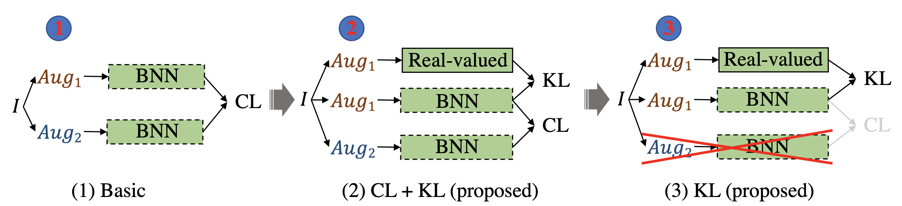

# S<sup>2</sup>-BNN (Self-supervised Binary Neural Networks Using Distillation Loss)

This is the official pytorch implementation of our paper:

 ["S2-BNN: Bridging the Gap Between Self-Supervised Real and 1-bit Neural Networks via Guided Distribution Calibration"](https://arxiv.org/abs/2102.08946) (CVPR 2021)
 
 by [Zhiqiang Shen](http://zhiqiangshen.com/), [Zechun Liu](https://zechunliu.com/), [Jie Qin](https://sites.google.com/site/firmamentqj/), [Lei Huang](https://huangleibuaa.github.io/), [Kwang-Ting Cheng](https://seng.ust.hk/about/people/faculty/tim-kwang-ting-cheng?id=326) and [Marios Savvides](https://www.ece.cmu.edu/directory/bios/savvides-marios.html).

<div align=center>

</div>

In this paper, we introduce a simple yet effective self-supervised approach using distillation loss for learning efficient binary neural networks.  Our proposed method can outperform the simple contrastive learning baseline ([MoCo V2](https://arxiv.org/abs/2003.04297)) by an absolute gain of 5.5∼15% on ImageNet. 

**The student models are not restricted to the binary neural networks, you can replace with any efficient/compact models.**

## News

**[Aug. 18, 2021]** Add ResNet-50 result as the student (real-valued model) with [SwAV/RN50-w4](https://github.com/facebookresearch/swav) as the teacher.

| Models | Pre-train epochs | batch size| linear cls. log | Top-1 (%) | Pre-train models |
| :---: | :-: | :-: | :-: | :------:| :------: | 
| [SimSiam](https://arxiv.org/abs/2011.10566) | 100 | 512 | [log](https://dl.fbaipublicfiles.com/simsiam/logs/100ep/linear.log) | 68.1 | [GitHub](https://github.com/facebookresearch/simsiam) |
| S2-BNN (Distillation_only) | 100 | 512 | [log](https://drive.google.com/file/d/1FIbcJ38_HzCuCIyPg3uPuoeD0_F6Fipj/view?usp=sharing) | **68.7** | [Download](https://drive.google.com/file/d/1eY-iVkYxxJfLhfeFBvStDzhtY3ns0p7S/view?usp=sharing) |

Note that we use the same linear evaluation procedure as [SimSiam](https://github.com/facebookresearch/simsiam).

## Citation

If you find our code is helpful for your research, please cite:

    @InProceedings{Shen_2021_CVPR,
    	author    = {Shen, Zhiqiang and Liu, Zechun and Qin, Jie and Huang, Lei and Cheng, Kwang-Ting and Savvides, Marios},
    	title     = {S2-BNN: Bridging the Gap Between Self-Supervised Real and 1-Bit Neural Networks via Guided Distribution Calibration},
    	booktitle = {Proceedings of the IEEE/CVF Conference on Computer Vision and Pattern Recognition (CVPR)},
    	year      = {2021}
}


## Preparation

### 1. Requirements:

* Python 
* PyTorch 
* Torchvision 

### 2. Data:
* Download ImageNet dataset following https://github.com/pytorch/examples/tree/master/imagenet#requirements.


## Training & Testing
To train a model, run the following scripts. All our models are trained with 8 GPUs.
### 1. Standard Two-Step Training:

#### Our enhanced MoCo V2:
#### Step 1:

  ```shell
  cd Contrastive_only/step1
  python main_moco.py --lr 0.0003 --batch-size 256 --dist-url 'tcp://localhost:10001' --multiprocessing-distributed --world-size 1 --rank 0 [imagenet-folder with train and val folders]  --mlp --moco-t 0.2 --aug-plus --cos -j 48  
  ```
  
#### Step 2: 
 
  ```shell
  cd Contrastive_only/step2
  python main_moco.py --lr 0.0003 --batch-size 256 --dist-url 'tcp://localhost:10001' --multiprocessing-distributed --world-size 1 --rank 0 [imagenet-folder with train and val folders]  --mlp --moco-t 0.2 --aug-plus --cos -j 48  --model-path ../step1/checkpoint_0199.pth.tar
  ```
  
#### Our MoCo V2 + Distillation Loss:
Download real-valued teacher network [here](https://dl.fbaipublicfiles.com/moco/moco_checkpoints/moco_v2_800ep/moco_v2_800ep_pretrain.pth.tar). We use MoCo V2 800-epoch pretrained model, while you can choose other stronger self-supervised models as the teachers.

#### Step 1:

  ```shell
  cd Contrastive+Distillation/step1
  python main_moco.py --lr 0.0003 --batch-size 256 --dist-url 'tcp://localhost:10001' --multiprocessing-distributed --world-size 1 --rank 0 [imagenet-folder with train and val folders] --mlp --moco-t 0.2 --aug-plus --cos -j 48 --wd 0  --teacher-path ../../moco_v2_800ep_pretrain.pth.tar 
  ```

#### Step 2:

  ```shell
  cd Contrastive+Distillation/step2
  python main_moco.py --lr 0.0003 --batch-size 256 --dist-url 'tcp://localhost:10001' --multiprocessing-distributed --world-size 1 --rank 0 [imagenet-folder with train and val folders] --mlp --moco-t 0.2 --aug-plus --cos -j 48 --wd 0  --teacher-path ../../moco_v2_800ep_pretrain.pth.tar --model-path ../step1/checkpoint_0199.pth.tar
  ```
  
#### Our Distillation Loss Only:
#### Step 1:

  ```shell
  cd Distillation_only/step1
  python main_moco.py --lr 0.0003 --batch-size 256 --dist-url 'tcp://localhost:10001' --multiprocessing-distributed --world-size 1 --rank 0 [imagenet-folder with train and val folders] --mlp --moco-t 0.2 --aug-plus --cos -j 48 --wd 0 --teacher-path ../../moco_v2_800ep_pretrain.pth.tar 
  ```

#### Step 2:

  ```shell
  cd Distillation_only/step2
  python main_moco.py --lr 0.0003 --batch-size 256 --dist-url 'tcp://localhost:10001' --multiprocessing-distributed --world-size 1 --rank 0 [imagenet-folder with train and val folders] --mlp --moco-t 0.2 --aug-plus --cos -j 48 --wd 0 --teacher-path ../../moco_v2_800ep_pretrain.pth.tar --model-path ../step1/checkpoint_0199.pth.tar
  ```

### 2. Simple One-Step Training (Conventional):
  
#### Our enhanced MoCo V2:  
  
  ```shell
  cd Contrastive_only/step2
  python main_moco.py --lr 0.0003 --batch-size 256 --dist-url 'tcp://localhost:10001' --multiprocessing-distributed --world-size 1 --rank 0 [imagenet-folder with train and val folders] --mlp --moco-t 0.2 --aug-plus --cos -j 48 
  ```
  
#### Our MoCo V2 + Distillation Loss:

  ```shell
  cd Contrastive+Distillation/step2
  python main_moco.py --lr 0.0003 --batch-size 256 --dist-url 'tcp://localhost:10001' --multiprocessing-distributed --world-size 1 --rank 0 [imagenet-folder with train and val folders] --mlp --moco-t 0.2 --aug-plus --cos -j 48 --wd 0 --teacher-path ../../moco_v2_800ep_pretrain.pth.tar 
  ```
  
#### Our Distillation Loss Only:
  
  ```shell
  cd Distillation_only/step2
  python main_moco.py --lr 0.0003 --batch-size 256 --dist-url 'tcp://localhost:10001' --multiprocessing-distributed --world-size 1 --rank 0 [imagenet-folder with train and val folders] --mlp --moco-t 0.2 --aug-plus --cos -j 48 --wd 0 --teacher-path ../../moco_v2_800ep_pretrain.pth.tar 
  ```
  
 
**You can replace binary neural networks with any kinds of efficient/compact models on one-step training.**

### 3. Testing:

* To linearly evaluate a model, run the following script:

  ```shell
  python main_lincls.py  --lr 0.1  -j 24  --batch-size 256  --pretrained  /home/szq/projects/s2bnn/checkpoint_0199.pth.tar --dist-url 'tcp://localhost:10001' --multiprocessing-distributed --world-size 1 --rank 0 [imagenet-folder with train and val folders] 

  ```

  
## Results & Models

We provide pre-trained models with different training strategies, we report in the table #Epochs, FLOPs, OPs, Top-1 accuracy on ImageNet validation set:

| Models | #Epoch | FLOPs (x10<sup>8</sup>)| OPs (x10<sup>8</sup>) | Top-1 (%) | Trained models |
| :---: | :-: | :-: | :-: | :------:| :------: | 
| MoCo V2 baseline | 200 | 0.12 | 0.87 |**46.9** | [Download](https://mbzuaiac-my.sharepoint.com/:u:/g/personal/zhiqiang_shen_mbzuai_ac_ae/Ect8PGTNPB5HimpS0DQDx28BhV8TOz195txkQaKrw_86HA?e=oRMX3B) |
| Our enhanced MoCo V2 | 200 | 0.12 | 0.87 | **52.5** | [Download](https://mbzuaiac-my.sharepoint.com/:u:/g/personal/zhiqiang_shen_mbzuai_ac_ae/EareSC9A14dFv4ViuV512akB5m6nJXmPvaHwIf6hIZxOYQ?e=uJ4A9x) |
| Our MoCo V2 + Distillation Loss | 200 | 0.12 | 0.87 | **56.0** | [Download](https://mbzuaiac-my.sharepoint.com/:u:/g/personal/zhiqiang_shen_mbzuai_ac_ae/EeSSV8evCSxHn1ABDMnlZy4BZDgpod7IziEGrsv5wXmQQQ?e=zGDfkh) |
|Our Distillation Loss Only| 200 | 0.12 | 0.87 | **61.5** | [Download](https://mbzuaiac-my.sharepoint.com/:u:/g/personal/zhiqiang_shen_mbzuai_ac_ae/EXFTgJYumo5KjIX_plUBkx8BtCG1waumevtzC6Qz-JsvpQ?e=uFDkJr) | 

### Training Logs

Our linear evaluation logs are availabe at [here](./logs).

## Acknowledgement  

[MoCo V2](https://github.com/facebookresearch/moco) (Improved Baselines with Momentum Contrastive Learning)

[ReActNet](https://github.com/liuzechun/ReActNet) (ReActNet: Towards Precise Binary NeuralNetwork with Generalized Activation Functions)

[MEAL V2](https://github.com/szq0214/MEAL-V2) (MEAL V2: Boosting Vanilla ResNet-50 to 80%+ Top-1 Accuracy on ImageNet without Tricks)
     
## Contact

Zhiqiang Shen, CMU (zhiqiangshen0214 at gmail.com) 
